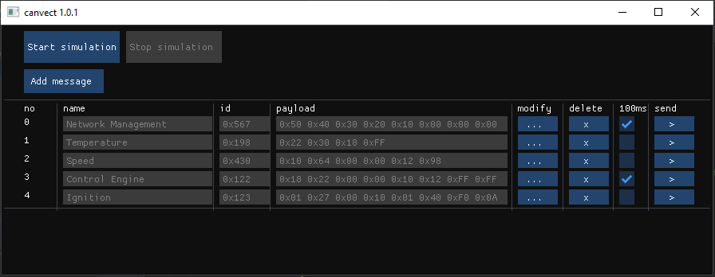
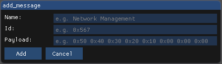

# canvector - CAN generator for Vector hardware

This application allows sending CAN frames using Vector hardware with no licence needed.

## Features

- Adding, deleting and modifying CAN frames
- Creating database containing frames configuration
- Sending CAN frames on trigger or periodically
- Validation of frames provided by user
- Compatible with Vector hardware
- No Vector licence required

## Usage

```python
python can_generator.py
```

### _Main window_



- To enable or disable sending messages use buttons '_Start simulation_' and '_Stop simulation_'.
- To modify or delete message use buttons placed on the right side of '_payload_' column.
- To send message periodically mark checkbox labeled '_100ms_'
- To send message once click button on the right side of checkbox

### _Add a new message_
To add a new message simply click on '_Add message_' button, new popup window will appear:


Provide _name_, _id_ and _payload_ of new message. After clicking '_Add_' button provided details
will be validated and added to database.

## Technologies
Python 3.9, all used third party packages are specifies in _requirements.txt_.

## License
[MIT](https://choosealicense.com/licenses/mit/)
